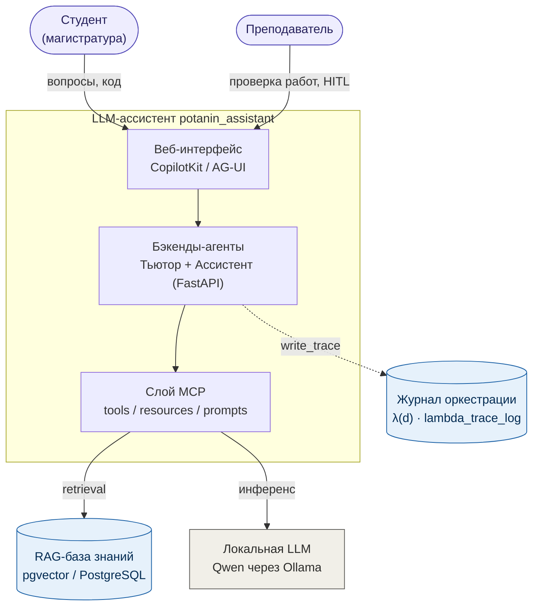

# LLM-ассистент для интеллектуальной поддержки обучения анализу данных в магистратуре

Публичная техническая документация проекта `potanin_assistant` — мультиагентного LLM-ассистента
для дисциплин магистратуры МГПУ «Python для анализа данных» и «Программные средства сбора,
консолидации и аналитики данных» (направление 38.04.05 «Бизнес-информатика»). Система переводит
практикумы по анализу данных от схемы «задание → выполнение → ручная проверка» к адаптивной
среде с интеллектуальной поддержкой: студент получает **Агента-Тьютора** (объяснения, разбор
ошибок, пре-валидация кода), преподаватель — **Агента-Ассистента** (пре-валидация работ и
предварительная оценка по рубрике), при этом финальная оценка всегда остаётся за преподавателем
(Human-in-the-loop). Ядро построено на LangGraph, Model Context Protocol (MCP) и RAG поверх
pgvector, с локальным инференсом модели Qwen через Ollama.

> **Это публичная документация для отчёта по гранту. Полный исходный код не публикуется.**
> Здесь приводятся архитектурные описания, диаграммы и контракты интерфейсов, но не рабочий
> код бизнес-логики, промпты-ядра, датасеты или веса моделей. Проприетарные компоненты
> (например, `EduRAG Loader`) описаны только на уровне назначения «вход/выход».

## Контекст системы

## Оглавление

### Архитектура

- [01. Обзор архитектуры](architecture/01_overview.md)
- [02. Компоненты и зоны ответственности](architecture/02_components.md)
- [03. Графы LangGraph](architecture/03_langgraph_agents.md)
- [04. Контракты MCP-инструментов](architecture/04_mcp_tools.md)
- [05. Конвейер RAG](architecture/05_rag_pipeline.md)
- [06. Журнал верифицируемой оркестрации `λ(d)`](architecture/06_trace_lambda.md)
- [07. Приватность и этика](architecture/07_data_privacy.md)
- Диаграммы (исходники Mermaid): [architecture/diagrams/](architecture/diagrams/)

### Смоук-тесты

- [Обзор](smoke_tests/README.md)
- [Протокол](smoke_tests/protocol.md)
- [Результаты (июль 2026)](smoke_tests/results_2026-07.md)

## Поддержка

> Работа выполнена при поддержке Благотворительного фонда Владимира Потанина (Стипендиальная
> программа Владимира Потанина, Грантовый конкурс для преподавателей). Проект «LLM-ассистент для
> интеллектуальной поддержки обучения анализу данных в магистратуре», МГПУ.

Права на результаты интеллектуальной деятельности принадлежат грантополучателю. Настоящая
документация распространяется на условиях лицензии [CC BY 4.0](LICENSE).

## Как ссылаться

См. файл [CITATION.cff](CITATION.cff).

## Контакты

Автор: Босенко Т. М. (МГПУ).
Рабочий e-mail: `<work_email>`.
