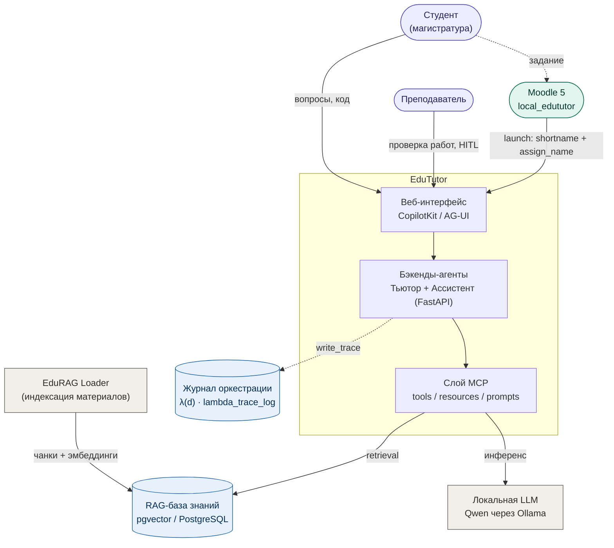

# EduTutor — LLM-ассистент для интеллектуальной поддержки обучения анализу данных в магистратуре

Публичная техническая документация продукта **EduTutor** (рабочий код в закрытом контуре:
каталог `potanin_assistant`) — мультиагентного LLM-ассистента для дисциплин магистратуры МГПУ
«Python для анализа данных» и «Программные средства сбора, консолидации и аналитики данных»
(направление 38.04.05 «Бизнес-информатика»).

Система переводит практикумы по анализу данных от схемы «задание → выполнение → ручная проверка»
к адаптивной среде с интеллектуальной поддержкой:

- студент получает **Агента-Тьютора** (объяснения, разбор ошибок, пре-валидация кода);
- преподаватель — **Агента-Ассистента** (пре-валидация работ и черновик оценки по рубрике);
- финальная оценка всегда остаётся за преподавателем (**Human-in-the-loop**).

Ядро: LangGraph, Model Context Protocol (MCP), RAG поверх pgvector, локальный инференс Qwen
через Ollama, интерфейс CopilotKit / AG-UI. Связь с LMS — универсальный плагин Moodle 5
(`local_edututor`): кнопка на задании → запуск Тьютора (оценки в Moodle в v1 не пишутся).

| | |
|---|---|
| Грант | № ГК26-000535, Стипендиальная программа В. Потанина, 2026 |
| Продуктовое имя | **EduTutor** |
| Код сервиса (закрытый контур) | `potanin_assistant` |
| Наполнение RAG | сервис **[EduRAG Loader](services/edurag_loader/)** (проприетарный код) |
| Мост LMS | Moodle 5 · `local_edututor` (универсальный, без JSON-карты заданий) |

> **Это публичная документация для отчёта по гранту. Полный исходный код не публикуется.**
> Здесь — архитектурные описания, диаграммы и контракты интерфейсов, без бизнес-логики,
> промптов-ядра, датасетов и весов моделей. Реализуемые сервисы контура (в т.ч. EduRAG Loader)
> описаны в разделе [Сервисы](#сервисы-контура-edututor); детали Loader — на уровне контракта
> «вход/выход».

## Контекст системы

## Оглавление

### Сервисы контура EduTutor

- **[EduRAG Loader](services/edurag_loader/)** — индексация учебных материалов → pgvector ([документация сервиса](services/edurag_loader/README.md))
- [Мост Moodle 5 (`local_edututor`)](architecture/08_moodle_bridge.md) — запуск Тьютора с assign
- Агенты, MCP, UI — см. разделы архитектуры ниже

### Архитектура

- [01. Обзор архитектуры](architecture/01_overview.md)
- [02. Компоненты и зоны ответственности](architecture/02_components.md)
- [03. Графы LangGraph](architecture/03_langgraph_agents.md)
- [04. Контракты MCP-инструментов](architecture/04_mcp_tools.md)
- [05. Конвейер RAG](architecture/05_rag_pipeline.md) · связан с [EduRAG Loader](services/edurag_loader/)
- [06. Журнал верифицируемой оркестрации `λ(d)`](architecture/06_trace_lambda.md)
- [07. Приватность и этика](architecture/07_data_privacy.md)
- [08. Мост Moodle 5 (`local_edututor`)](architecture/08_moodle_bridge.md)
- Диаграммы (исходники Mermaid): [architecture/diagrams/](architecture/diagrams/)

### Смоук-тесты

- [Обзор](smoke_tests/README.md)
- [Протокол](smoke_tests/protocol.md)
- [Результаты (июль 2026)](smoke_tests/results_2026-07.md)

## Карта сервисов гранта (логическая)

| Сервис | Назначение | Публично |
|---|---|---|
| **EduTutor UI** | Чат, generative UI, HITL, `/moodle/launch` | архитектура |
| **Агент-Тьютор** | RAG, пре-валидация кода, без оценок | архитектура + контракты |
| **Агент-Ассистент** | Черновик оценки + HITL | архитектура + контракты |
| **MCP** | tools / resources / prompts / sandbox | контракты инструментов |
| **EduRAG Loader** | Индексация материалов → pgvector | **[services/edurag_loader/](services/edurag_loader/README.md)** |
| **Moodle `local_edututor`** | Кнопка на assign → HMAC launch | [08_moodle_bridge](architecture/08_moodle_bridge.md) |
| **Ollama (Qwen)** | Локальный инференс | описание стека |

Конкретные хосты и порты в публичной документации заменены плейсхолдерами `<host>` / `<port>`.

## Связь с рабочим репозиторием

Публичный репозиторий содержит **только** архитектуру и протоколы. Рабочий код EduTutor
(`potanin_assistant`), EduRAG Loader, плагин Moodle и статусный отчёт живут в закрытом контуре
гранта. Формулировка назначения системы и схема ролей студент/преподаватель **совпадают** с
этим README. Бренд продукта — **EduTutor**; упоминание фонда Потанина сохраняется в блоке
поддержки и в `CITATION.cff`.

## Поддержка

> Работа выполнена при поддержке Благотворительного фонда Владимира Потанина (Стипендиальная
> программа Владимира Потанина, Грантовый конкурс для преподавателей, грант № ГК26-000535).
> Проект «LLM-ассистент для интеллектуальной поддержки обучения анализу данных в магистратуре»,
> МГПУ.

Права на результаты интеллектуальной деятельности принадлежат грантополучателю. Настоящая
документация распространяется на условиях лицензии [CC BY 4.0](LICENSE).

## Как ссылаться

См. файл [CITATION.cff](CITATION.cff).

## Контакты

Автор: Босенко Т. М. (МГПУ).
Рабочий e-mail: `<work_email>`.
