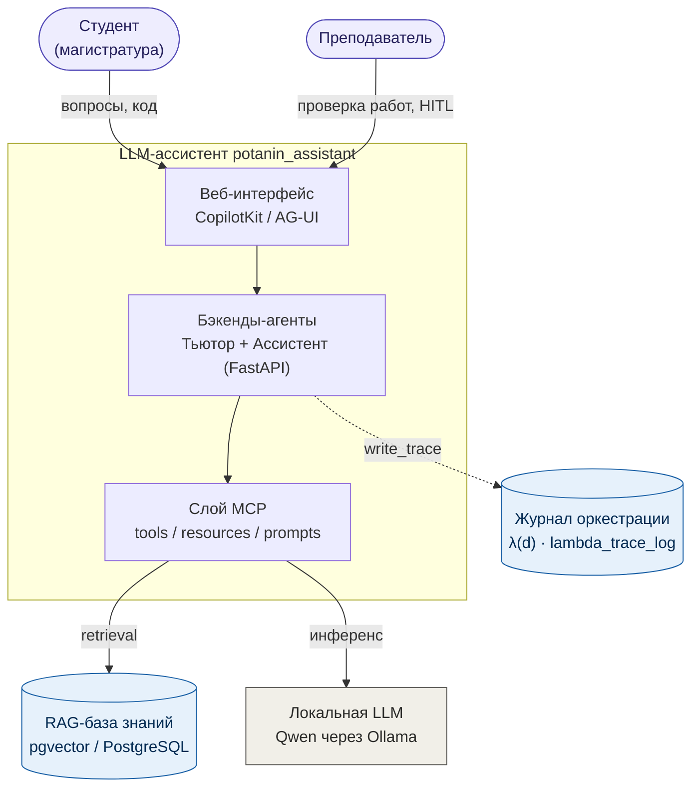
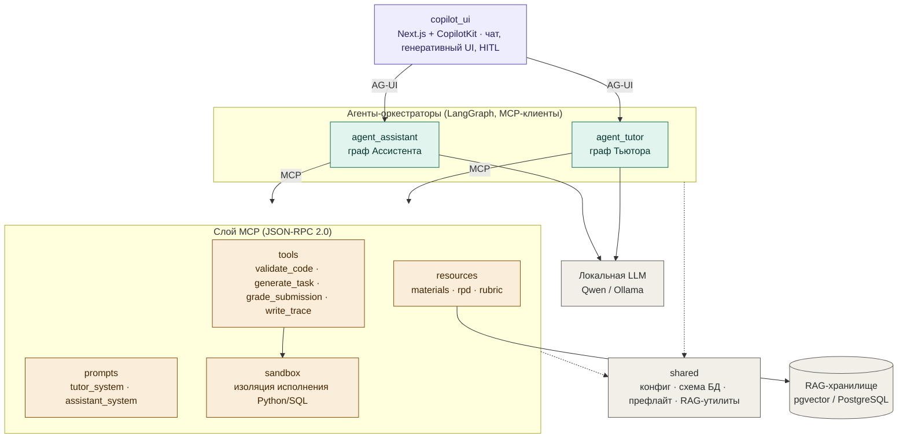

# 01. Обзор архитектуры

## Назначение системы

`potanin_assistant` — мультиагентный LLM-ассистент для интеллектуальной поддержки
обучения анализу данных в магистратуре МГПУ (направление 38.04.05 «Бизнес-информатика»,
дисциплины «Python для анализа данных» и «Программные средства сбора, консолидации и
аналитики данных»). Система переводит практикумы от схемы «задание → выполнение → ручная
проверка» к адаптивной среде с интеллектуальной поддержкой в реальном времени для двух
категорий пользователей — студентов и преподавателей.

> Настоящий документ описывает архитектуру на уровне компонентов и контрактов.
> Исходный код бизнес-логики, системные промпты-ядра, датасеты и веса моделей не публикуются.

## Две роли агентов

Система строится вокруг двух интеллектуальных агентов поверх общего слоя инструментов и
локальной языковой модели.

- **Агент-Тьютор** — для студента. Объясняет материал по верифицированной базе знаний курса,
  разбирает ошибки, в «режиме агента» выполняет пре-валидацию присланного студентом кода
  (Python/SQL) в изолированной песочнице. **Оценок не выставляет**; помогает наводящими
  вопросами, не выдавая готовое решение целиком (философия «duck debugging»).
- **Агент-Ассистент** — для преподавателя. Принимает присланные работы, прогоняет их в
  песочнице и формирует **предварительную** оценку по рубрике с пояснением по критериям.

## Принцип Human-in-the-loop

Финальная оценка всегда остаётся за преподавателем. Human-in-the-loop реализован как
**управляемое состояние графа** (а не как текстовая инструкция в промпте): предварительная
оценка фиксируется в статусе «черновик» (`draft`), граф Ассистента приостанавливается и ждёт
явного решения преподавателя, и только после подтверждения оценка переходит в статус
`approved`. Это гарантирует, что автоматическая эвристика не может самостоятельно выставить
итоговый балл.

## Ключевой стек

| Слой | Технология (обобщённо) |
|---|---|
| Оркестрация агентов | LangGraph (графы состояний) |
| Взаимодействие «агент ↔ инструменты/данные» | Model Context Protocol (MCP), JSON-RPC 2.0 |
| База знаний / RAG | pgvector поверх PostgreSQL |
| Языковая модель | локальная Qwen через Ollama (приватность внутри контура вуза), облачный API — резерв |
| Веб-интерфейс | CopilotKit / AG-UI (чат, генеративный UI, HITL) |
| Бэкенды | FastAPI |
| Журнал верифицируемой оркестрации | `λ(d)` (`lambda_trace_log`) |

## Контекстная диаграмма

## Слоевая структура (компоненты)

Ключевая идея архитектуры: **CopilotKit / AG-UI стоит _над_ MCP-агентами, а не вместо них**.
MCP — это слой «агент ↔ инструменты/данные» (ядро); AG-UI — слой «агент ↔ интерфейс»,
который лишь отображает результат работы MCP-агентов.

Подробное описание модулей — в [02_components.md](02_components.md).
