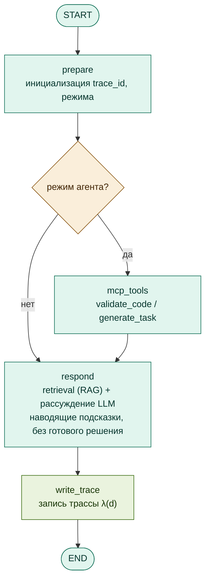
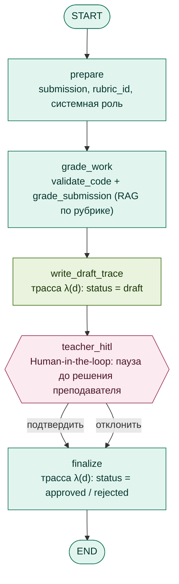

# 03. Графы LangGraph

Оба агента реализованы как графы состояний LangGraph. Граф описывает узлы (шаги обработки),
переходы между ними и объект состояния (state), который накапливается по мере прохождения.
Ниже приводятся структура графов и назначение полей состояния — **без исходного кода**.

---

## Граф Тьютора (`tutor_graph`)

Обслуживает студента. Имеет два режима, определяемых полем состояния «режим агента»:

- **Обычный чат** — пассивный режим: retrieval по базе знаний + ответ модели, без вызова
  инструментов действия.
- **Режим агента** — активный режим: агент может вызывать `validate_code` и `generate_task`
  через MCP; результаты обогащают контекст ответа.

### Узлы и переходы

| Узел | Назначение |
|---|---|
| `prepare` | Инициализация идентификатора трассы, нормализация флагов запроса (режим, курс, вариант). |
| `mcp_tools` | Только в режиме агента: пре-валидация кода (`validate_code`) и/или генерация задания (`generate_task`) через MCP. |
| `respond` | Retrieval (RAG) по материалам курса + рассуждение модели. Формирует **наводящие подсказки**, не выдавая готовое решение целиком. Здесь же пишется трасса `λ(d)`. |

Точка принятия решения — после `prepare`: если включён режим агента, поток идёт в `mcp_tools`,
иначе сразу в `respond`.

### Объект состояния (обобщённо)

| Поле | Назначение |
|---|---|
| `messages` | История сообщений диалога. |
| `agent_mode` | Флаг активного режима (доступ к инструментам). |
| `course`, `variant` | Выбранный курс и вариант задания (фильтрация RAG). |
| `difficulty`, `topic` | Параметры для генерации задания. |
| `validation_result` | Структурированный результат `validate_code` (для генеративного UI). |
| `task_result` | Результат `generate_task`. |
| `trace_id` | Сквозной идентификатор запроса для трассы `λ(d)`. |
| `timings` | Тайминги стадий (профилирование). |

---

## Граф Ассистента (`assistant_graph`)

Обслуживает преподавателя. Реализует Human-in-the-loop как управляемое состояние.

### Узлы и переходы

| Узел | Назначение |
|---|---|
| `prepare` | Извлечение работы (submission), идентификатора рубрики, загрузка системной роли из MCP-prompt. |
| `grade_work` | Проверка работы: `validate_code` (вердикт исполнения) + `grade_submission` (предварительная оценка по рубрике с использованием RAG). |
| `write_draft_trace` | Запись трассы `λ(d)` со статусом `draft` — до вмешательства преподавателя. |
| `teacher_hitl` | **Human-in-the-loop**: граф приостанавливается (`interrupt`). Интерфейс показывает черновик оценки и ждёт решения «подтвердить / скорректировать / отклонить». |
| `finalize` | После решения преподавателя: запись трассы со статусом `approved` или `rejected` и формирование итогового сообщения. |

### Объект состояния (обобщённо)

| Поле | Назначение |
|---|---|
| `submission`, `rubric_id`, `lang` | Работа студента, идентификатор рубрики, язык. |
| `system_prompt` | Системная роль Ассистента (загружается из MCP-prompt). |
| `validation_result` | Результат проверки исполнения. |
| `grading_result`, `draft_ui` | Предварительная оценка и её представление для UI. |
| `approved`, `final_grade`, `teacher_response` | Итог Human-in-the-loop: решение и финальная оценка преподавателя. |
| `trace_status`, `trace_step`, `trace_last_h_out` | Состояние цепочки трасс `λ(d)` (статус, шаг, связность хешей). |
| `trace_id`, `timings` | Идентификатор запроса и тайминги. |

### Где реализован Human-in-the-loop

Точка HITL — узел `teacher_hitl`. Граф **физически останавливается** на нём до получения
явного решения преподавателя от интерфейса. Пока решение не получено, зафиксирован лишь
`draft`; итоговая оценка (`approved`) невозможна без действия человека. Это ключевая гарантия
качества: автоматика не может выставить финальный балл.
