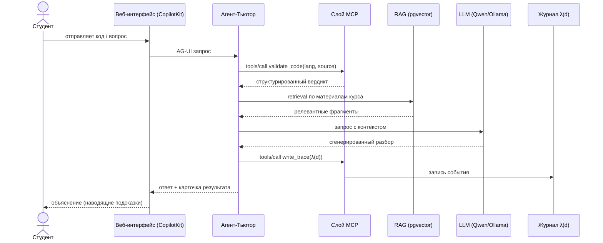

# 04. Контракты MCP-инструментов

Слой MCP (Model Context Protocol) объявляет три типа примитивов: **Tools** (действия),
**Resources** (данные для чтения) и **Prompts** (шаблоны ролей). Клиент-оркестратор при
подключении делает discovery (`tools/list`, `resources/list`, `prompts/list`), затем вызывает
их по JSON-RPC 2.0.

Ниже приводятся **контракты инструментов** — сигнатуры и назначение, без тел функций и
реализации.

## Tools (действия)

| Инструмент | Назначение | Вход | Выход | Кто вызывает |
|---|---|---|---|---|
| `validate_code` | Проверка кода Python/SQL в изолированной песочнице | `lang: "python" \| "sql"`, `source: str`, `tests?: list` | `{ syntax_ok, lint, tests_passed, stderr, summary }` | Тьютор, Ассистент |
| `generate_task` | Генерация адаптивного учебного задания под курс и уровень | `course: str`, `difficulty: "easy" \| "medium" \| "hard"`, `topic: str` | `{ task, expected_solution, ... }` | Тьютор |
| `write_trace` | Запись размеченной трассы `λ(d)` в журнал | `trace: dict` (поля трассы, см. [06_trace_lambda.md](06_trace_lambda.md)) | `{ ok: bool, ... }` | Тьютор, Ассистент |
| `grade_submission` | Предварительная оценка работы по рубрике (черновик для преподавателя) | `submission: str`, `rubric_id: str` | `{ score, max_score, per_criterion: [...], explanation, draft: true }` | **только Агент-Ассистент** |

### Примечания к контрактам

- **`validate_code`** возвращает структурированный вердикт (статус синтаксиса, замечания
  линтера, результат прогона тестов, поток ошибок, краткая сводка). Само исполнение
  происходит в песочнице без доступа к сети (см. [02_components.md](02_components.md)).
- **`generate_task`** может обогащать формулировку релевантным фрагментом из базы знаний
  курса (RAG). Эталонное решение возвращается как каркас, а не как проприетарный датасет.
- **`write_trace`** записывает одно событие оркестрации в журнал `λ(d)`; это основа метрик
  прослеживаемости и воспроизводимости.
- **`grade_submission`** доступен **исключительно Агенту-Ассистенту** и всегда возвращает
  результат со статусом черновика (`draft: true`). Это программная реализация принципа
  Human-in-the-loop: инструмент не имеет права выставить финальную оценку — она фиксируется
  только после подтверждения преподавателя в графе Ассистента.

## Resources (данные для чтения)

| Ресурс | Назначение |
|---|---|
| `materials://{course}` | Материалы курса из RAG-хранилища (pgvector) — контент для ответов и генерации заданий. |
| `rpd://{discipline}` | Рабочая программа дисциплины (темы, сроки). |
| `rubric://{assignment}` | Рубрика оценивания (критерии и баллы) для `grade_submission`. |

## Prompts (шаблоны ролей)

| Шаблон | Назначение |
|---|---|
| `tutor_system` | Системная роль Тьютора: вести наводящими вопросами, не выдавать готовый код. |
| `assistant_system` | Системная роль Ассистента: проверка по критериям, обоснование предварительной оценки. |

> Тексты-ядра системных промптов являются проприетарными и в публичной документации не
> приводятся — указано только их назначение.

## Последовательность вызовов (пре-валидация кода студента)

## Безопасность слоя MCP

Описания инструментов MCP читаются моделью — это потенциальная поверхность для prompt-injection.
Меры защиты: RAG строго по верифицированной базе знаний курса; для удалённого транспорта —
авторизация и TLS; песочница исполнения без доступа к сети и файловой системе контура вуза.
