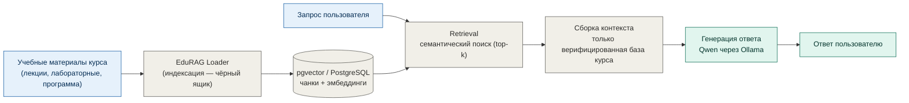

# 05. Конвейер RAG

Retrieval-Augmented Generation (RAG) обеспечивает, чтобы ответы агентов строились **только по
верифицированной базе знаний курса**, а не по «памяти» модели. Это ключевая мера снижения
риска галлюцинаций: модель отвечает, опираясь на извлечённые фрагменты реальных учебных
материалов.

## Схема конвейера

## Этапы

### 1. Индексация — `EduRAG Loader` (чёрный ящик)

Загрузка учебных материалов в базу знаний выполняется отдельным компонентом **EduRAG Loader**.
В публичной документации он описывается только как «чёрный ящик» по контракту вход/выход;
реализация является проприетарной.

- **Вход:** учебные материалы курса (лекции, лабораторные, программа дисциплины и т. п.).
- **Обработка (обобщённо):** разбиение на фрагменты (чанки) с перекрытием, векторизация
  многоязычной моделью эмбеддингов, транзакционная запись в хранилище с метаданными курса
  (курс, тип материала, тема).
- **Выход:** векторный индекс — фрагменты материалов с эмбеддингами в хранилище.

> Требование согласованности: агенты выполняют поиск той же моделью эмбеддингов и той же
> размерностью вектора, что использованы при индексации.

### 2. Хранилище — pgvector / PostgreSQL

Фрагменты и их эмбеддинги хранятся в таблице базы знаний поверх расширения `pgvector` для
PostgreSQL. Каждый фрагмент снабжён метаданными (курс, тип материала, тема), что позволяет
фильтровать retrieval по конкретному курсу.

### 3. Retrieval (извлечение)

По запросу пользователя вычисляется вектор запроса, и по косинусному расстоянию извлекаются
наиболее релевантные фрагменты (top-k) с фильтрацией по курсу.

### 4. Сборка контекста

Извлечённые фрагменты собираются в контекстный блок. В базу передаётся **только верифицированный
контент курса** — это ограничивает пространство ответов проверенными материалами.

### 5. Генерация ответа

Локальная модель **Qwen через Ollama** формирует ответ на основе собранного контекста.
Инференс выполняется локально, внутри контура вуза (см. [07_data_privacy.md](07_data_privacy.md)).

## Снижение риска галлюцинаций

- Ответ строится по извлечённым фрагментам верифицированной базы курса, а не по обобщённым
  «знаниям» модели.
- Retrieval ограничен материалами выбранного курса (фильтр по метаданным).
- Для инструментов действия (например, проверки кода) используется детерминированная
  песочница, а не генерация модели.

> Датасеты, промпты-ядра и содержимое базы знаний в публичную документацию не включены.
