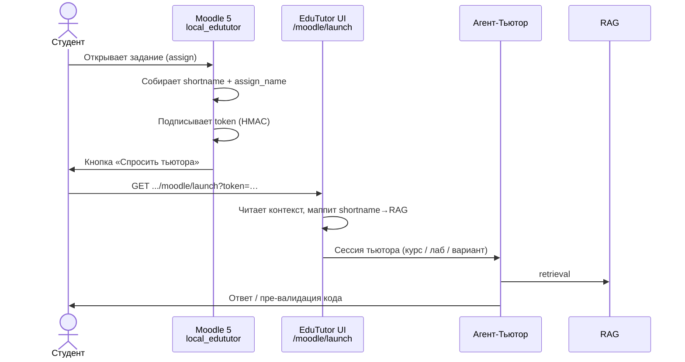

# 08. Мост Moodle 5 (`local_edututor`)

Универсальный тонкий плагин LMS для запуска **EduTutor** со страницы задания Moodle.
**Вариант A (v1):** кнопка на `mod_assign` → HMAC-токен → UI Тьютора. Оценки в журнал Moodle
**не пишутся**. JSON-карта заданий в Moodle **не требуется**.

> Не путать со штатным «AI tools administration» / Workplace AI (GPT, Ollama, Gemini). EduTutor
> подключается отдельным плагином-мостом, а не как провайдер встроенного AI Moodle.

## Назначение

| Делаем | Не делаем (v1) |
|---|---|
| Кнопка «Спросить тьютора» на **любом** assign любого курса | Запись в gradebook |
| Передача `course_shortname` + `assign_name` (+ id, user, role) | Обязательная JSON-карта assign |
| HMAC shared secret на стороне Moodle | Провайдер в AI tools Workplace |
| Сопоставление shortname → RAG на стороне EduTutor | Автооценка без HITL |

## Поток запуска

## Контракт токена (обобщённо)

Формат: `{base64url(json)}.{base64url(hmac_sha256)}`.

Полезные поля полезной нагрузки (без секретов развёртывания):

| Поле | Смысл |
|---|---|
| `moodle_user_id` / `moodle_username` | Кто открыл тьютора |
| `course_id` / `course_shortname` / `course_fullname` | Курс Moodle |
| `cmid` / `assign_id` / `assign_name` | Задание |
| `role` | `student` или `teacher` |
| `exp` | Срок действия (unix time) |

URL запуска: `http://<host>:<port>/moodle/launch?token=...`

Сопоставление `course_shortname` с ключом курса в RAG выполняется **на стороне EduTutor**
(не в Moodle). Эвристики lab/варианта могут опираться на текст `assign_name`
(например, «Лабораторная 2», «вариант 1»).

## Установка (логика для отчёта)

1. Администратор Moodle загружает плагин **через веб** (ZIP компонента `local_edututor`) —
   без обязательного SSH на сервер LMS.
2. В настройках локального плагина задаются: включение, базовый URL UI EduTutor (доступный
   **в браузере студента**), общий HMAC-секрет, TTL токена.
3. После включения кнопка появляется на страницах всех заданий сайта.
4. Плагин **удаляется** штатно: Администрирование → Плагины → Обзор плагинов → Удалить.

Конкретные URL, секреты и внутренние IP в публичную документацию не включаются.

## Зоны ответственности

- **Moodle-плагин** — только контекст страницы и подпись token.
- **EduTutor** — RAG, диалог, пре-валидация; в v1 не пишет оценки обратно в Moodle.
- **Агент-Ассистент / HITL** — отдельный контур UI для преподавателя; не через gradebook LMS.

## Приватность

В token уходят идентификаторы Moodle и названия курса/задания, необходимые для старта сессии.
Персональные данные диалогов и содержимое работ обрабатываются внутри контура EduTutor
(см. [07_data_privacy.md](07_data_privacy.md)). В v1 оценки в Moodle не передаются.
