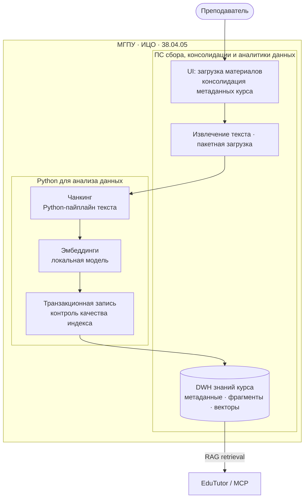

# 4. Архитектура решения

## Академический контур

| Параметр | Значение |
|---|---|
| Университет | Московский городской педагогический университет (**МГПУ**) |
| Институт | Институт цифрового образования (**ИЦО**) |
| Специальность | **38.04.05** Бизнес-информатика |
| Профиль | Бизнес-аналитика и большие данные (очная форма) |
| Дисциплина 1 | «Программные средства сбора, консолидации и аналитики данных» |
| Дисциплина 2 | «Python для анализа данных» |
| Грантовый продукт-потребитель | EduTutor (LLM-тьютор / ассистент) |

Архитектура демонстрирует цикл **Data Pipeline → Analytical Store → Downstream Analytics/AI**:
сбор и консолидация учебных документов, Python-обработка и хранение в аналитическом DWH с
векторным поиском.

## Тип архитектуры

**Клиент–серверное веб-приложение** с выделенным слоем данных:

- **Presentation** — браузерный UI;
- **Application** — маршруты, валидация, оркестрация ingest;
- **Processing** — извлечение текста, чанкинг, эмбеддинги;
- **Data** — PostgreSQL + pgvector (таблица знаний курса).

На этапе Loader достаточно одного сервиса ingest. Потребители RAG (EduTutor) — **отдельные
сервисы**, читающие то же хранилище (логическая SOA).

## Компонентная схема

## Связь компонентов с дисциплинами

### «Программные средства сбора, консолидации и аналитики данных»

| Компонент Loader | Содержание дисциплины |
|---|---|
| Веб-форма и комплекты шаблонов | Сбор учебных артефактов в единый контур |
| Метаданные курса / типа / темы | Консолидация: единая схема атрибутов |
| Векторное хранилище знаний | Аналитический DWH для поиска и отчётности |
| Агрегаты по курсу | Контроль наполненности корпуса |

### «Python для анализа данных»

| Компонент Loader | Содержание дисциплины |
|---|---|
| Пайплайн чанкинга | Алгоритмическая обработка текстовых последовательностей |
| Локальные эмбеддинги | Применение ML на Python к учебным данным |
| Транзакционная запись | Надёжная фиксация результата пайплайна |
| Предпросмотр фрагментов | Валидация до «публикации» в хранилище |

## Поток данных (логически)

1. Преподаватель загружает учебный документ с метаданными курса и темы.
2. Режим **предпросмотра** готовит фрагменты и эмбеддинги **без** записи в БД.
3. Режим **подтверждения** выполняет транзакционную запись в хранилище.
4. EduTutor выполняет семантический поиск по тому же индексу (согласованные префиксы
   индексации и запроса на стороне закрытого контура).

Параметры чанкинга, схема DDL и сетевые адреса развёртывания **не публикуются**.
См. также [конвейер RAG](../../architecture/05_rag_pipeline.md).
