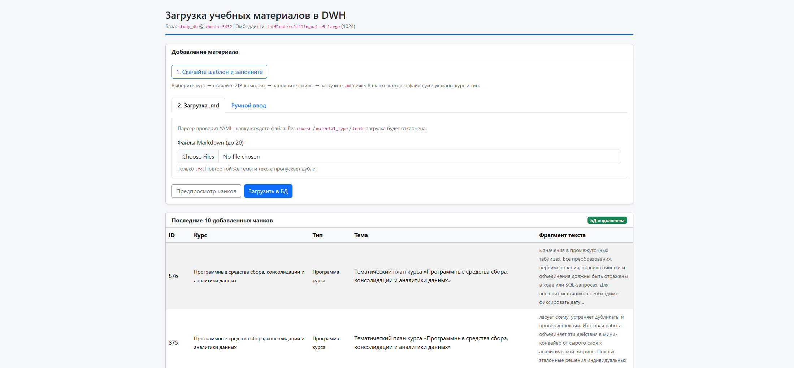
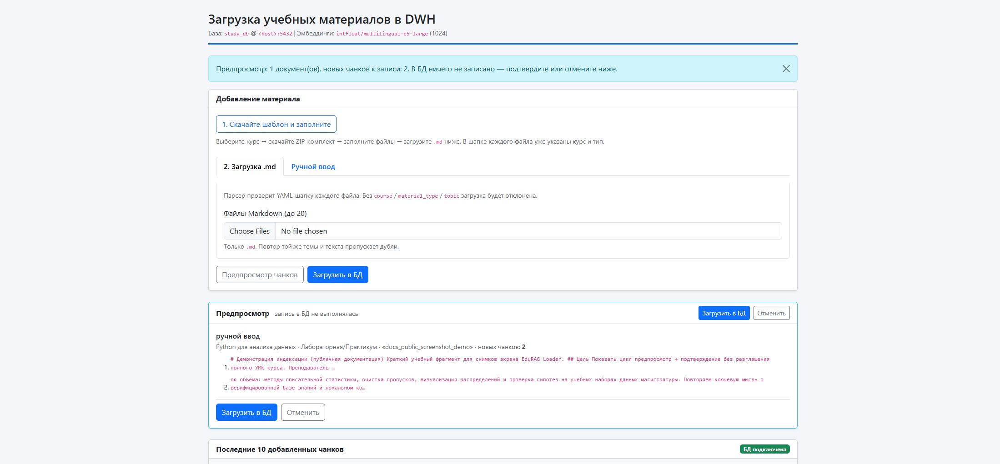
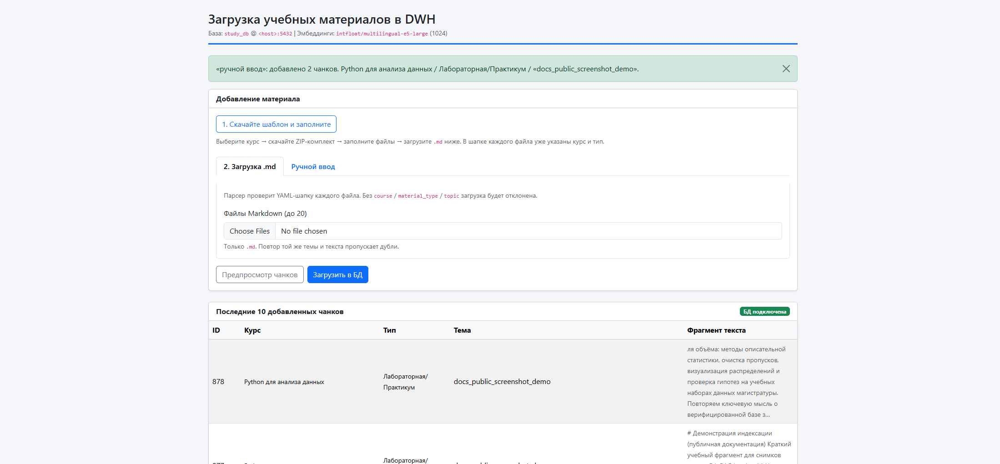
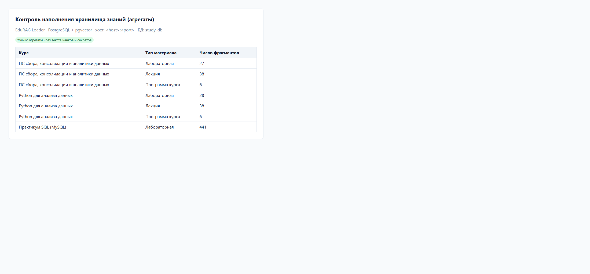
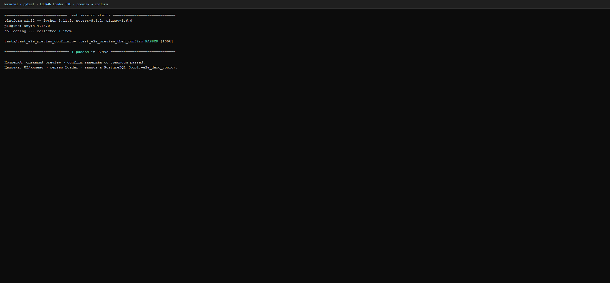
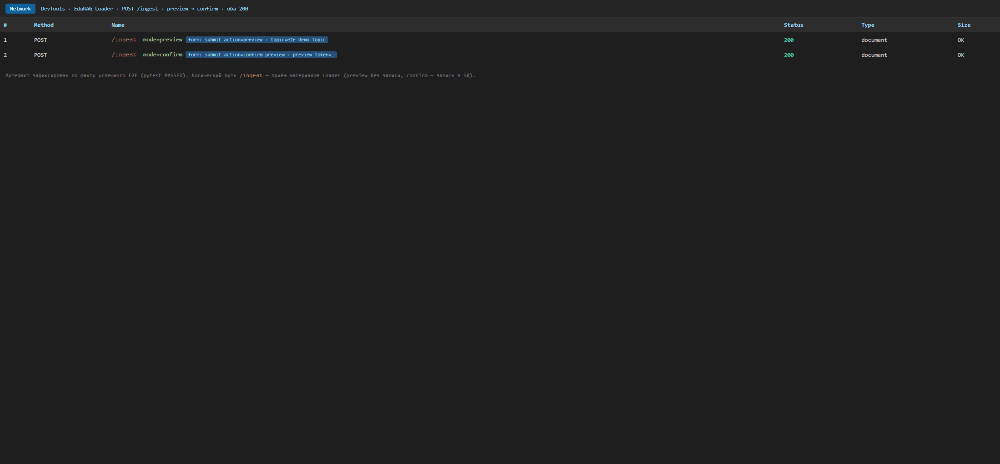
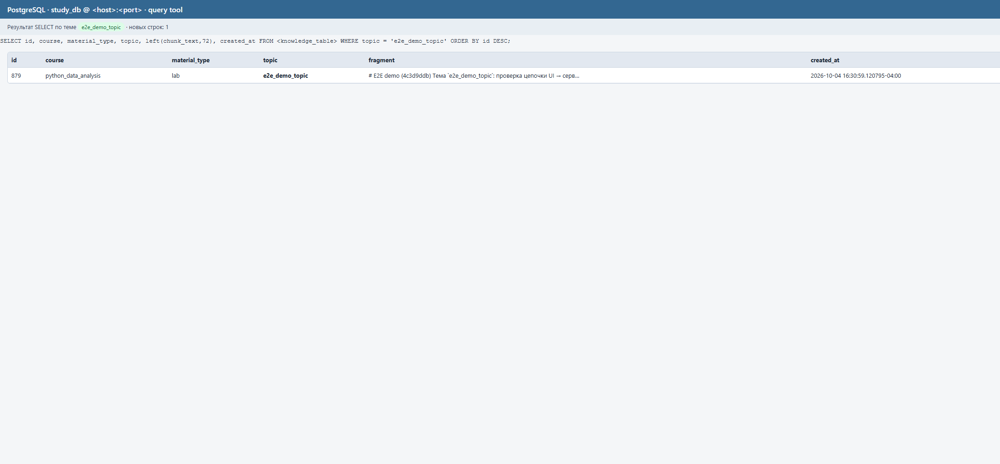

# 6. Результат работы программы

Скриншоты сняты с работающего EduRAG Loader и лежат в [`img/`](img/).
На снимках внутренний адрес СУБД заменён на плейсхолдер `<host>`.

## 6.1. Главный экран Loader

**Подпись:** стартовая страница сервиса. Видны индикатор готовности СУБД/векторного расширения,
форма загрузки структурированных учебных документов и лента последних фрагментов.

## 6.2. Предпросмотр фрагментов (без записи)

**Подпись:** режим предпросмотра. Пользователь видит нарезанные фрагменты и метаданные курса/темы.
UI явно показывает, что до подтверждения хранилище не изменяется.

## 6.3. После подтверждения записи

**Подпись:** после подтверждения отображается сообщение об успешной индексации; новые фрагменты
появляются в ленте последних записей интерфейса.

## 6.4. Контроль в СУБД

**Подпись:** аналитический контроль наполнения DWH — только агрегаты по курсам и типам материалов
(без текста чанков, паролей и внутренних IP).

## 6.5. Подтверждение прохождения автотеста (E2E)

Критерий приёмки интеграционного теста складывается из **трёх артефактов** — по одному на каждое
звено цепочки UI → сервер → БД. Сценарий: **preview → confirm** (тема `e2e_demo_topic`).

### 6.5.1. Консоль / CI — pytest PASSED

**Подпись:** `pytest` сообщает, что сценарий preview → confirm прошёл, статус **passed**.

### 6.5.2. Фронтенд — Network: POST /ingest

**Подпись:** на вкладке Network видны POST-запросы на `/ingest` сначала с режимом **preview**,
затем **confirm**; оба с ответом **200**.

### 6.5.3. База данных — строки с `e2e_demo_topic`

**Подпись:** в клиенте СУБД видны новые строки с темой `e2e_demo_topic` в таблице фрагментов.

### Критерий приёмки

Вместе эти три снимка доказывают, что действие пользователя (или автотеста) прошло через сервер
и закончилось реальной записью в базе. Именно это и есть критерий приёмки интеграционного теста.

## Ожидаемый педагогический результат

- Два целевых курса магистратуры индексируются управляемо.
- Преподаватель контролирует качество индекса через предпросмотр.
- EduTutor опирается на верифицированный корпус, а не на «память» модели.
- Цепочка ingest проверяется E2E-артефактами (§6.5).
